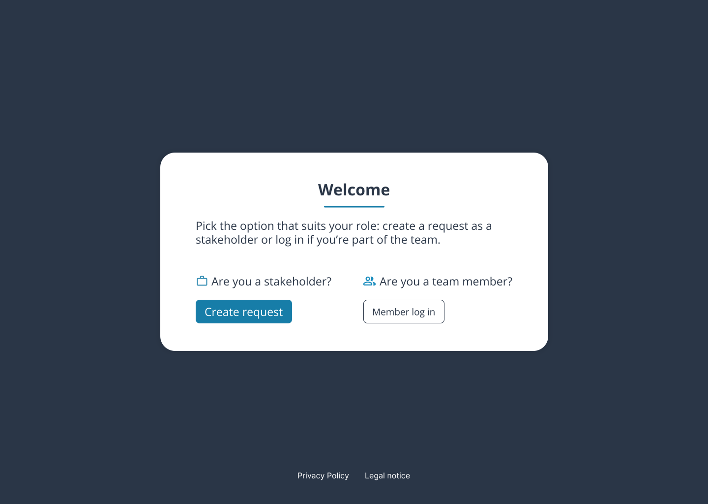
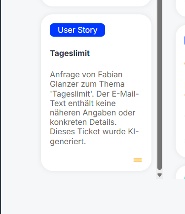
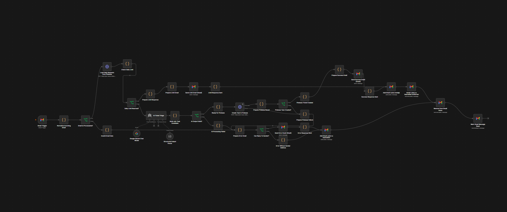

# Join Issue Collector

Join Issue Collector extends the existing Join Kanban application with an AI-assisted email intake workflow. Stakeholders can submit feature requests, technical tasks, and bug reports by email. n8n processes the message, uses Google Gemini to structure the request, creates a ticket in Firebase, and places it in Join's **Triage** column.

## Project preview

### Public role selection



The public entry page follows the supplied Figma design and separates stakeholder access from the normal Join team-member login.

### AI-generated Join ticket



Successfully processed stakeholder emails are converted into Join tasks, marked as AI-generated, and created in **Triage**.

### n8n email intake workflow



The intake workflow combines Gmail, the Firebase-based daily limit, Google Gemini, Firebase ticket creation, response emails, and mailbox filing.

## Demo entry points

- Public role selection / landing page: `issue-collector.html`
- Stakeholder request page: `stakeholder.html`
- Issue Collector email: `fabian.glanzer99+join@gmail.com`
- Join login / board entry: `index.html`

The stakeholder request page displays the current daily usage and provides a direct email action for new requests.

## Issue Collector flow

1. A stakeholder sends an email to `fabian.glanzer99+join@gmail.com`.
2. n8n receives the message through the Gmail Trigger.
3. The workflow checks the daily limit before using the AI service.
4. Google Gemini extracts and generates the Join ticket data:
   - title
   - description
   - category: `Technical Task`, `User Story`, or `Bug Request`
   - priority: `urgent`, `medium`, or `low`
   - deadline only when one is actually present in the email
   - explicitly listed subtasks, when available
5. The ticket is created in Firebase with `column: "triage"` and is marked as AI-generated.
6. The sender receives a confirmation email.
7. Successfully handled messages receive the Gmail label `erledigt`; processing failures receive `zu bearbeiten`.
8. When a ticket with a stored creator email changes status, a second n8n workflow emails the creator — for both email-generated and manually created tickets.

## Daily limit

The email collector accepts a maximum of **10 successfully generated email tickets per Europe/Vienna calendar day**. Requests above the limit do not call the AI service and do not create a Join ticket. The sender receives an automatic limit response.

Firebase's task collection is the single source of truth for the daily limit. Both the stakeholder page and n8n count successfully created tickets with:

- `source: "email"`
- `aiGenerated: true`
- a `createdAt` date matching the current Europe/Vienna calendar day

This keeps the displayed `x of 10` value and the backend enforcement in sync.

## Join features

- Firebase Authentication with registered-user and guest login
- Summary dashboard
- Kanban board with `Triage`, `To do`, `In progress`, `Await feedback`, and `Done`
- Drag-and-drop task movement
- Task search and filtering
- Create, edit, and delete tasks
- `Technical Task`, `User Story`, and `Bug Request` categories
- Priorities, due dates, assignments, and subtasks
- Internal/external creator information in task details
- AI-generated ticket indicator
- Contact management
- Responsive layouts for desktop, tablet, and mobile

## Tech stack

- HTML5
- CSS3
- Vanilla JavaScript
- Firebase Authentication
- Firebase Realtime Database
- n8n
- Gmail OAuth2
- Google Gemini in n8n
- Stylelint

## Project structure

```text
join-issue-collector/
├── assets/
│   ├── icons/
│   ├── images/
│   ├── fonts/
│   └── screenshots/
├── n8n/                    # Exported workflows and technical documentation
├── scripts/                # Application logic and Firebase integration
├── styles/                 # Global/page/component styles
├── subpages/               # Join application pages
├── templates/              # Reusable HTML template functions
├── index.html              # Join login
├── issue-collector.html    # Public role selection
├── stakeholder.html        # Stakeholder request page
├── script.js               # Shared application state/utilities
└── style.css               # Global styles
```

## Local development

The project is a static frontend and can be served with VS Code Live Server or another local HTTP server.

For Join login/sign-up, `scripts/firebaseConfig.js` is created locally from `scripts/firebaseConfig.example.js` using the Firebase **Web App** configuration for the Join project. The real local config is excluded from Git.

The public Issue Collector entry point is:

```text
/issue-collector.html
```

## n8n workflows

The exported workflows are located in `n8n/`:

- `01-email-intake.json` — Gmail intake, Firebase-based daily limit, AI triage, Firebase ticket creation, stakeholder responses, and mailbox filing
- `02-status-notifications.json` — status-change notifications to ticket creators
- `README.md` — technical documentation of both workflows
- `task-schema.example.json` — example structure for generated Join tasks

Credentials are configured directly in n8n and are not stored in the repository.

## Verified behavior

The completed implementation was tested for the following flows:

- stakeholder email intake through the dedicated `+join` address
- AI-based title, category, priority, description, optional deadline, and subtask generation
- automatic ticket creation in `Triage`
- external creator metadata for email-generated tickets
- internal creator metadata for manually created tickets
- success responses after ticket creation
- error/manual-review handling
- Gmail filing with `erledigt` and `zu bearbeiten`
- Firebase-backed `x of 10` daily usage display
- blocking of additional requests when the daily limit is reached
- status notification emails after board-column changes
- duplicate-notification protection through `lastNotifiedColumn`

## Security

The repository does **not** contain:

- Gmail OAuth tokens or passwords
- Google Gemini/API credentials
- Firebase admin or service-account credentials
- n8n encryption keys
- `.env` files
- local n8n credential data

Firebase browser configuration is kept outside Git through `.gitignore` in `scripts/firebaseConfig.js`; `scripts/firebaseConfig.example.js` documents the expected frontend structure.

The current Firebase access model should be reviewed before a public production deployment. Tightening Firebase rules may require authenticated database requests from Join and n8n.

## Code quality

The project uses dedicated JavaScript modules for more complex application logic. The stakeholder landing flow uses semantic HTML5 and `scripts/issueCollector.js` for the live daily-usage display.

CSS linting is available through:

```bash
npm install
npm run lint:css
```

## Legal pages

Join includes dedicated **Privacy Policy** and **Legal Notice** pages. They are linked from both the login page and the stakeholder landing page.
